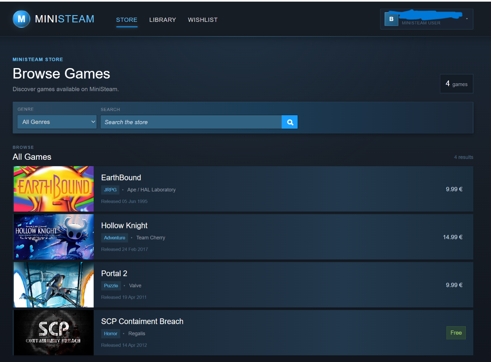
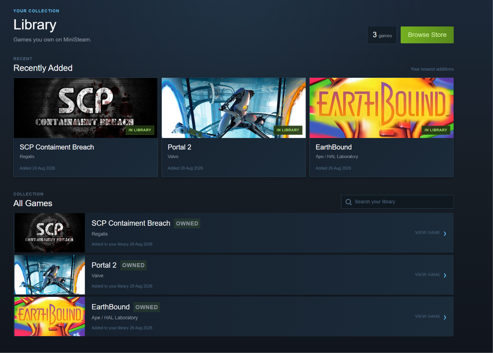
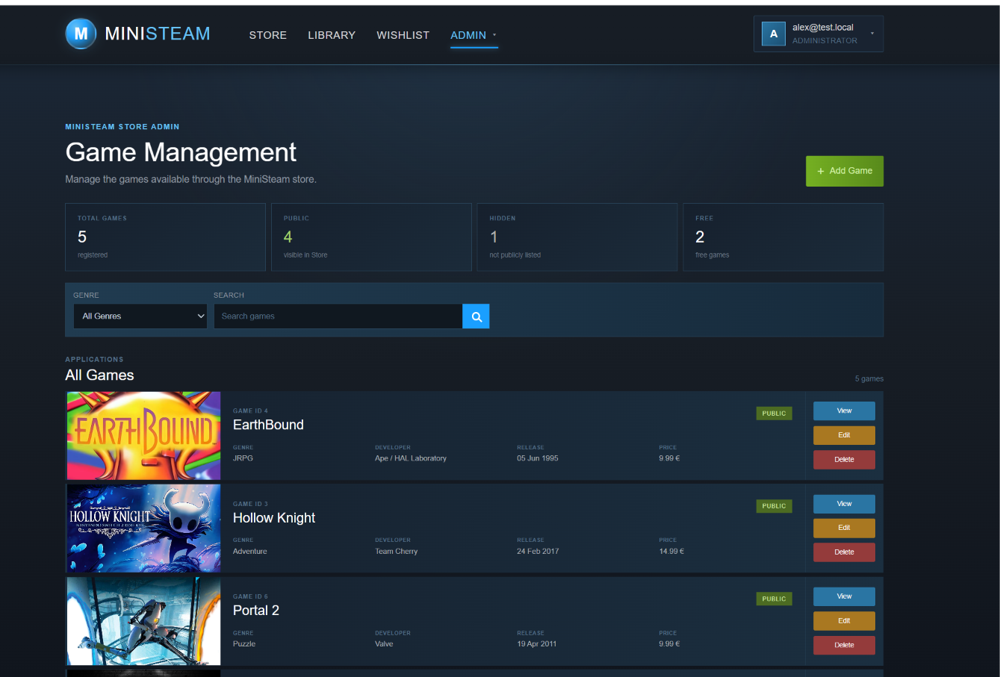

# MiniSteam

MiniSteam is an educational ASP.NET Core MVC game store application.

The project was created to practice full-stack web development with ASP.NET Core MVC, Entity Framework Core, Identity, authorization, relational databases and user-specific application features.

MiniSteam is inspired by modern digital game storefronts, while using its own simplified functionality and interface.

## Screenshots

### Store



### Library



### Admin Game Management



## Features

### Store
- Public game catalog
- Search by game title
- Genre filtering
- Game details pages
- Public and hidden games
- Free and paid games

### User Accounts
- Registration
- Login and logout
- ASP.NET Core Identity
- User and Admin roles
- Change password
- Forgot password
- Password reset by email

### Library
- Personal game library
- Ownership checks
- Purchased games remain associated with the user
- Hidden owned games remain accessible from the owner's library

### Wishlist
- Add games to wishlist
- Remove games from wishlist
- Duplicate protection
- Purchased games are automatically removed from the wishlist

### Purchases
- Simulated game purchases
- Purchase history
- Purchase date
- Historical purchase price
- Protection against duplicate purchases

### Reviews
- Write reviews for owned games
- Edit reviews
- Delete reviews
- Recommended / Not Recommended system
- One review per user per game
- Review ownership protection
- Public review display

### Administration
- Game CRUD
- Genre CRUD
- Public / hidden game management
- Game image upload
- Image validation
- Protection against deleting games referenced by purchase history
- Protection against deleting genres currently used by games

## Technologies

- .NET 10
- ASP.NET Core MVC
- Entity Framework Core 10
- ASP.NET Core Identity
- SQL Server LocalDB
- Razor Views
- MailKit
- Bootstrap
- HTML
- CSS
- JavaScript

## Project Structure

The application follows the ASP.NET Core MVC architecture:

```text
Controllers/
Data/
Helpers/
Migrations/
Models/
    Entities/
    ViewModels/
Views/
wwwroot/
```

Entities represent data stored in the database.

ViewModels are used when a page or form requires data that should not be mapped directly to a database entity.

## Requirements

To run MiniSteam locally, install:

- .NET 10 SDK
- Visual Studio 2022 or another compatible .NET development environment
- SQL Server LocalDB or another compatible SQL Server instance

## Database Setup

The repository already contains the Entity Framework Core migrations required by the project.

The current migration chain includes the latest model synchronization migration:

```text
SyncCurrentModel
```

After cloning the repository, apply the existing migrations.

### Visual Studio Package Manager Console

```powershell
Update-Database
```

### .NET CLI

```bash
dotnet restore
dotnet ef database update
```

Do not create a new initial migration when setting up the existing project.

The migrations are already included in the repository.

## Running the Application

After the database has been created, run the application from Visual Studio or use:

```bash
dotnet run
```

The default route opens the MiniSteam Store.

## Roles and Authorization

MiniSteam uses two application roles:

```text
User
Admin
```

The roles are created automatically when the application starts.

Newly registered users receive the `User` role.

Administrator-only functionality includes:

- Game management
- Genre management
- Hidden game administration

The development seed can promote an existing test account to the `Admin` role.

The administrator account itself is not automatically created.

## Email and Password Recovery

MiniSteam uses SMTP email for password recovery.

Real SMTP passwords are not stored in the repository.

The mail password should be configured locally using ASP.NET Core User Secrets.

Example:

```bash
dotnet user-secrets set "Mail:Password" "YOUR_APP_PASSWORD"
```

The public application configuration contains no SMTP password.

Never commit real passwords, API keys or other secrets to source control.

## Game Images

Uploaded game artwork is stored in:

```text
wwwroot/images/games
```

Supported image formats:

```text
JPG
JPEG
PNG
WEBP
```

Maximum upload size:

```text
5 MB
```

Uploaded images are validated by the server before being stored.

## Security Features

MiniSteam includes several server-side protections:

- Role-based authorization
- User ownership checks
- Anti-forgery validation on state-changing forms
- Server-side purchase validation
- Duplicate purchase protection
- Duplicate wishlist protection
- Duplicate review protection
- Review ownership validation
- Hidden game access checks
- Password reset tokens
- User Secrets for SMTP credentials

Client-side checks are used only for interface convenience. Important permissions and ownership rules are validated on the server.

## Purchase System

MiniSteam does not process real payments.

Purchases are simulated application transactions used to demonstrate relational data and store functionality.

When a purchase is completed, MiniSteam stores a snapshot of the game's price at the time of purchase.

This allows purchase history to preserve the original transaction price even if the current game price later changes.

## Privacy

MiniSteam stores information required for its application features, including:

- Account information
- Library ownership
- Wishlist entries
- Purchase history
- Reviews
- Relevant timestamps

Public reviews do not display the user's email address.

## Educational Purpose

MiniSteam was created as an educational programming project.

It is not affiliated with, endorsed by, or connected to Valve Corporation or Steam.

The project does not provide real commercial payment processing.

## Current Status

MiniSteam v1 is complete.

The first version includes the primary functionality planned for the project:

```text
Store
Authentication
Authorization
Library
Wishlist
Purchases
Reviews
Password Recovery
Game Administration
Genre Administration
Image Upload